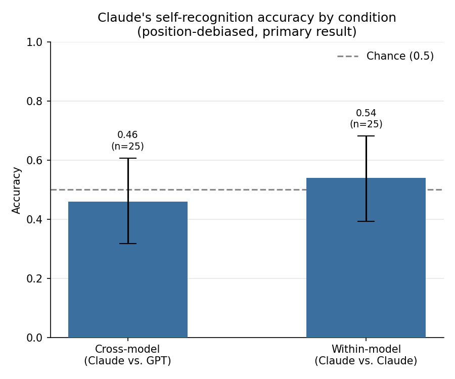
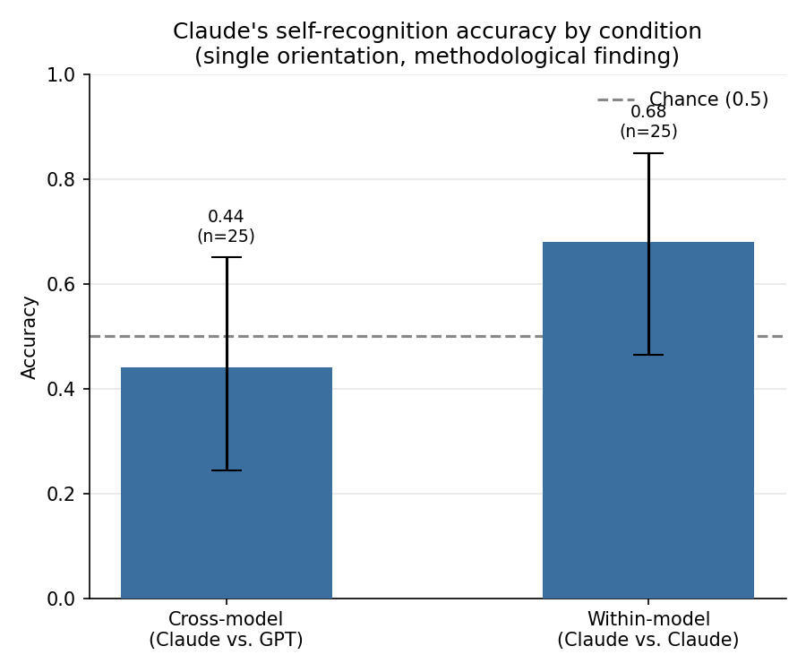

# self-recognition-llm

Can Claude tell its own writing apart from another model's, or from itself at a different temperature, using nothing but the text?

## Research question

Given only the raw text of two answers to the same reasoning question, can Claude identify which one it wrote, at accuracy reliably above chance (50%)? We test this separately in two conditions:

1. **Cross-model**: Claude's answer vs. a different model's (GPT) answer to the same prompt.
2. **Within-model**: Claude's answer vs. Claude's own answer to the same prompt, generated at a different temperature.

## Motivation

Self-recognition is a strange capacity. In human cognition it shows up early and matters a lot. Infants pass the mirror test around 18 months. People recognize their own voice on a recording, often with a moment of discomfort, because the internal sense of self and the external signal do not fully match. In both cases, recognizing your own output as yours seems to depend on having some internal model of what "you" typically produce.

Language models raise a strange variant of this question. A model has no persistent memory across conversations, no continuous stream of experience, nothing that obviously corresponds to a self in the way the term is normally used. But it does have something like a consistent output distribution, a set of tendencies in word choice, structure, and reasoning style shaped by training. If that distribution is consistent enough, it might in principle be detectable, not by a human reader, but by the model itself, looking at text with no memory of having written it.

This project does not try to answer whether language models have anything like self-awareness. That question is not well posed for a system with no persistent state, and this experiment cannot speak to it. What it asks is much smaller and much more tractable: does Claude's output carry a statistically detectable signature, one that Claude itself can pick up on in a blind, memoryless setting, above what chance alone would produce.

A positive result would not prove the presence of an internal self-model. But it would be consistent with the idea that something like a stable output signature exists, and that the model has some access to it, indirectly, through pattern recognition rather than introspection. A null result would be just as informative. It would suggest that whatever consistency exists in the model's writing is either too subtle for the model to detect in this setting, or that the notion of a recognizable "voice" does not transfer cleanly from human cognition to token prediction at all.

Either outcome is a small, honest data point toward a much larger and still open question in the study of intelligence, whether the kind of self-modeling that supports biological self-recognition has any meaningful analogue in systems built entirely differently, with no body, no continuous memory, and no evolutionary pressure to develop one. This experiment does not resolve that question. It tries to ask one small, falsifiable version of it, cleanly enough that the answer means something.

Beyond the philosophical framing, the question has a practical edge too. If models carry a detectable stylistic signature, that has direct relevance to AI-generated content detection and model watermarking research, and it gives a concrete, testable angle on the more general question of whether models have anything like a consistent, recognizable voice at all.

## Related work

The cognitive-science framing above (the mirror test, voice recognition) isn't something this experiment tests directly, it's motivation, not a methodological commitment. What actually grounds the design and hypothesis is a narrower line of machine learning work on self-recognition and evaluation bias in language models.

Panickssery, Bowman, and Feng (2024), ["LLM Evaluators Recognize and Favor Their Own Generations"](https://arxiv.org/abs/2404.13076), found that LLM evaluators such as GPT-4 and Llama 2 have non-trivial, above-chance accuracy at distinguishing their own outputs from those of other models and from humans out of the box, and that self-recognition capability is linearly correlated with the strength of self-preference bias. They also control for positional bias in their pairwise comparisons by prompting the evaluator twice per example with the options swapped and averaging the two scores. That's the same label-swapping technique Stage 3b/4c uses here to debias the accuracy figures below, so it's worth being explicit: this repo isn't improvising that fix, it's applying a control that's already standard practice on closely related tasks.

Positional bias itself is well documented outside self-recognition specifically. Zheng et al. (2023), ["Judging LLM-as-a-Judge with MT-Bench and Chatbot Arena"](https://arxiv.org/abs/2306.05685), showed LLM judges can favor a response based on its position (A vs. B) independent of content quality, and Shi et al. (2024), ["Judging the Judges: A Systematic Study of Position Bias in LLM-as-a-Judge"](https://arxiv.org/abs/2406.07791), studied the effect across 15 judges and roughly 40 solution-generating models, confirming it's not attributable to chance and varies by judge and task. The bias found in this repo's own Stage 4 (see Results) sits at the extreme end of what that literature documents.

Ackerman and Panickssery (2024), ["Inspection and Control of Self-Generated-Text Recognition Ability in Llama3-8b-Instruct"](https://arxiv.org/abs/2410.02064), found that the instruction-tuned Llama3-8b-Instruct model, but not the corresponding base model, can reliably tell its own writing apart from human writing, and traced the ability to a specific, causally implicated direction in the residual stream, evidence the capability is acquired during post-training rather than present from pretraining alone, and that it looks more like a learned familiarity signal than introspective access to one's own generative process. One difference worth flagging: their setup tests self-generated text against human-written text, not against another model's output. A positive self-vs-human result doesn't straightforwardly predict a positive self-vs-other-model result, since telling yourself apart from another sophisticated generator is a different, arguably harder problem than telling yourself apart from an unrelated human text distribution, which is exactly what this repo's cross-model (Claude vs. GPT) condition asks.

Closer to this repo's own qualitative analysis, Ji et al. (2025), ["'I know myself better, but not really greatly': How Well Can LLMs Detect and Explain LLM-Generated Texts?"](https://arxiv.org/abs/2502.12743), tested six models on detecting and explaining LLM-generated text. Self-detection consistently beat cross-detection, but both stayed far from reliable, and the models' stated explanations for their judgments were frequently built on inaccurate or superficial features even when the prediction itself was right. That's close to what Stage 5 finds here: Claude's justifications read as fluent and stylistically specific whether or not the underlying choice was actually correct, which is what you'd expect if a justification is generated after the fact to rationalize a choice rather than reported as its genuine basis.

The most recent and most relevant paper for framing the null result below is Ardoin, Schäfer, and Wunder (2026), ["LLM Self-Recognition: Steering and Retrieving Activation Signatures"](https://arxiv.org/abs/2606.06315). Their headline result, over 98% detection accuracy, comes from an artificial steering intervention: injecting a small vector into a model's residual stream during generation to create a deliberate, watermark-like fingerprint. That's not what's relevant here. More relevant is a separate part of their paper (Section 3.1) that tests self-recognition on ordinary, unmodified text: an activation-based classifier applied to a model's own summaries versus human-written ones, with no steering involved. There, the activation classifier reliably outperforms a perplexity baseline, especially once the classifier no longer has access to the original prompt, a setting where the perplexity baseline falls apart and the activation-based one doesn't. It's this unsteered result, not the headline steering number, that matters for Interpretation below.

Most self-recognition studies use long-form or creative text, where topic and content differences alone could leak identity, a model's known voice on essay writing, for instance. This experiment constrains the domain to short, factual reasoning explanations (math and logic, 80-120 words) specifically to close off that route: the content is tightly bounded by the problem itself, so any detectable signal is more likely to be genuinely stylistic. It also separates a cross-model condition from a within-model condition (same model, different sampling temperature), which isolates whether "self-recognition" reflects cross-architecture differences or something more subtle about a model's consistency with itself across sampling runs. And it treats positional bias as a first-class result rather than an afterthought, applying the label-swapping correction directly to the headline number instead of only flagging the bias qualitatively.

## Interpretation

A null result here doesn't mean there's no stylistic signature to find. Ackerman and Panickssery traced self-recognition in Llama3-8b-Instruct to a specific direction in the residual stream that doesn't look like it routes through anything resembling deliberate introspection. Ardoin, Schäfer, and Wunder's unsteered activation classifier picks up a self-recognition signal well before it would ever reach the surface of a model's stated judgments, the only channel this experiment has access to. Put together, they point at a real possibility: the signal lives in the representations, and asking Claude to introspect and report on it in plain text is a lossy way to get at it, maybe an unreliable one.

That's not something this experiment demonstrates on its own, it never had access to anything but Claude's choices and justifications. It's something the activation-level literature makes plausible. Testing it directly would take a different kind of experiment built around an open-weights model's internals rather than its text output (see Future Work).

## Hypothesis

- **Null hypothesis (H0):** Claude's accuracy at identifying its own text equals chance level (0.5), for each condition.
- **Alternative hypothesis (H1):** Claude's accuracy differs from chance level (0.5), for each condition.

Tested with a two-sided exact binomial test (`scipy.stats.binomtest`) against p = 0.5, separately for the cross-model and within-model conditions.

## Experimental design

**Prompt set (25 total, fixed via `RANDOM_SEED = 42`):**
- 15 problems sampled from [GSM8K](https://huggingface.co/datasets/openai/gsm8k) (grade-school math), test split.
- 10 problems sampled from [BIG-Bench-Hard](https://huggingface.co/datasets/lukaemon/bbh) logical reasoning subtasks (`logical_deduction_three_objects`, `causal_judgement`).
- Problems are filtered to exclude those whose problem statement exceeds 120 words (a heuristic proxy for "answerable in 80-120 words"); the true constraint is enforced by instructing every generation to stay within an 80-120 word target.

**Models:**
- Claude: `claude-sonnet-4-6` (override via `CLAUDE_MODEL` env var). Note: newer Claude models (e.g. `claude-sonnet-5`, Opus 4.7+) reject non-default `temperature` values outright, which would break the within-model manipulation below; `claude-sonnet-4-6` was chosen specifically because it still accepts arbitrary temperature values.
- OpenAI comparison model: `gpt-5.5` (override via `OPENAI_MODEL` env var), chosen to be roughly capability-matched to the Claude model used, so the cross-model comparison isn't confounded by a large capability gap. Note: `gpt-5.5` also rejects non-default `temperature` values outright (only its API default, 1.0, is accepted), so the OpenAI generation call omits `temperature` entirely and always runs at that default. This means, unlike the rest of the generation conditions (length target, system instruction, max tokens), temperature is not actually matched between Claude and GPT in the cross-model condition; see Limitations.

**Generation (Stage 1):** for each of the 25 prompts, three answers are generated under a shared system instruction (80-120 words, direct, no meta-commentary):
- Claude at temperature 0.7 (`claude_t0.7`): used as "Claude's own" answer in both conditions.
- GPT at its API default temperature (`gpt_default`): the cross-model comparison text. `gpt-5.5` does not accept a custom temperature value, so this runs at 1.0 rather than being matched to Claude's 0.7.
- Claude at temperature 0.3 (`claude_t0.3`): the within-model comparison text. (The Claude API has no `seed` parameter, unlike OpenAI's; temperature is the only lever available for producing a distinguishable second Claude sample, so the within-model condition varies temperature rather than seed.)

This yields 75 generation calls (25 prompts × 3 generations).

**Pairing and randomization (Stage 2):** for each prompt, one cross-model pair (`claude_t0.7` vs. `gpt_default`) and one within-model pair (`claude_t0.7` vs. `claude_t0.3`) are built (50 pairs total). For each pair, a seeded random assignment decides which text is shown as "A" and which as "B". The blinded pair data (question + text A + text B, no source labels) and the ground-truth labels (which side is actually Claude's) are written to **separate files** (`data/pairs_blinded/classification_input.json` vs. `data/pairs_blinded/ground_truth.json`) so it's easy to verify Stage 3 never sees the answer key.

**Classification (Stage 3, the actual experiment):** for each of the 50 blinded pairs, a **fresh, independent** API call is made to Claude. There is no shared conversation context with any generation call or any other classification call. Claude is shown the question and both labeled texts and asked which one it believes it wrote, with a brief justification. This is the core methodological constraint: Claude is not recalling a past conversation, only judging stylistic signal from the text alone. 50 classification calls.

**Swapped-orientation classification (Stage 3b):** for each of the same 50 pairs, the A and B texts are swapped and a second, equally fresh and independent Claude call classifies the swapped presentation. Every pair is therefore judged once with Claude's real text on its originally-assigned side, and once with it on the opposite side. 50 more classification calls.

Total API calls across the pipeline: 75 (generation) + 50 (Stage 3 classification) + 50 (Stage 3b swapped classification) = **175**, above the target range of ~100-150 stated at the outset. This deviation exists because the position-debiasing follow-up (Stage 3b/4c) was added after the original pipeline was built and run, in response to the positional bias found by Stage 4/4b; it was judged a worthwhile trade-off since the alternative was reporting a headline result now known to be substantially confounded.

**Analysis (Stage 4):** accuracy per condition, two-sided binomial test vs. chance (0.5) with 95% CI per condition, a comparison of accuracy between the two conditions (Fisher's exact test on the 2×2 correct/incorrect × condition table), and a chi-square goodness-of-fit test on the A/B choice distribution to check for positional bias.

**Position-controlled analysis (Stage 4b):** if Stage 4 finds a positional bias, raw accuracy could be an artifact of that bias rather than genuine self-recognition, since a systematic preference for one side, combined with a non-uniform distribution of where Claude's real text landed, can inflate or deflate accuracy independent of any stylistic signal. Stage 4b cross-tabulates the position of Claude's actual text (A or B, from ground truth) against Claude's chosen answer (A or B), separately per condition, and recomputes accuracy conditioned on position: accuracy among pairs where Claude's real text was A, versus accuracy among pairs where it was B. A sharp collapse in accuracy (toward or below chance) specifically when Claude's real text was on the non-favored side is evidence the raw accuracy figure is confounded by positional bias.

**Position-debiased analysis (Stage 4c, the primary result):** rather than only diagnosing the positional bias, Stage 4c corrects for it directly using the Stage 3b data. For each pair, a debiased score is computed as the average of correctness in the original orientation and correctness in the swapped orientation (1.0 if correct both times, 0.5 if correct exactly once, 0.0 if correct neither time). Per condition, both orientations of every pair are pooled into a single two-sided binomial test against chance (0.5), giving a debiased accuracy, p-value, and 95% CI. This pooling treats each pair's two orientations as approximately independent trials for testing purposes; see Limitations.

**Qualitative analysis (Stage 5):** each justification is categorized (via keyword matching) into one of: `word_choice`, `sentence_structure`, `tone`, `reasoning_style`, `quality_heuristic`, `vague_generic`. Category distributions are compared between correct and incorrect predictions.

**Visualization (Stage 6):** a bar chart of accuracy per condition, with a chance-level reference line at 0.5 and error bars from the 95% CI, one chart for the primary position-debiased result (Stage 4c) and one for the single-orientation result (Stage 4).

## Setup and how to reproduce

### Dependencies

```bash
pip install -r requirements.txt
```

### API keys

```bash
cp .env.example .env
# edit .env and fill in ANTHROPIC_API_KEY and OPENAI_API_KEY
```

`.env` is loaded automatically (via `python-dotenv`), and once real keys are present there, they're always used, there's no separate flag to force mock mode while real keys are configured. Mock mode only triggers when no `.env` file with real keys exists (`.env` missing, or its key values left blank): in that case the pipeline substitutes deterministic placeholder text for every generation and classification call, so the full pipeline (sampling, generation, pairing, classification, stats, qualitative, chart) can be dry-run and verified end to end with zero API cost.

### Running

```bash
# full pipeline
python run_pipeline.py

# or stage by stage
python src/sample_prompts.py       # Stage 0: sample & filter prompts
python src/stage1_generate.py      # Stage 1: generate stimuli
python src/stage2_pairs.py         # Stage 2: build & randomize pairs
python src/stage3_classify.py      # Stage 3: classification (the experiment)
python src/stage3b_classify_swapped.py  # Stage 3b: classification, A/B swapped
python src/stage4_analyze.py       # Stage 4: statistics
python src/stage4b_position_control.py  # Stage 4b: position-controlled accuracy
python src/stage4c_debiased_analysis.py # Stage 4c: position-debiased accuracy (primary result)
python src/stage5_qualitative.py   # Stage 5: qualitative analysis
python src/stage6_visualize.py     # Stage 6: chart
```

Or via `make`: `make install`, `make pipeline`, or individual targets (`make sample`, `make generate`, `make pairs`, `make classify`, `make classify_swapped`, `make analyze`, `make position_control`, `make debiased_analyze`, `make qualitative`, `make visualize`).

### Data layout

- `prompts/prompts.json`: the sampled, filtered prompt set.
- `data/raw/generations.json`: every generated answer with full metadata (prompt id, source model, temperature, timestamp, raw text). Not used by Stage 3.
- `data/pairs_blinded/classification_input.json`: what Stage 3 and Stage 3b actually see (question + text A + text B, no labels).
- `data/pairs_blinded/ground_truth.json`: which side is actually Claude's, kept separate from the blinded file.
- `data/results/classification_results.json`: Claude's choice + justification per pair, original A/B orientation.
- `data/results/classification_results_swapped.json`: Claude's choice + justification per pair, swapped A/B orientation.
- `data/results/statistics.json`: single-orientation accuracy, binomial tests, condition comparison, positional bias.
- `data/results/position_control.json`: single-orientation accuracy conditioned on the position of Claude's real text (A or B), per condition, plus the underlying cross-tabulations.
- `data/results/debiased_statistics.json`: the primary result, per-pair and per-condition position-debiased accuracy, pooling both orientations.
- `data/results/qualitative_analysis.json`: justification categorization (Stage 3 original-orientation justifications only).
- `data/results/accuracy_chart.png`: the primary Stage 6 chart, position-debiased accuracy.
- `data/results/accuracy_chart_single_orientation.png`: the secondary Stage 6 chart, single-orientation accuracy, for the methodological finding.

## Results

### Primary result: position-debiased accuracy (Stage 3b / Stage 4c)

Because Stage 4 found a strong positional bias (below), the single-orientation accuracy is not treated as the headline result. Instead, Stage 3b re-classifies every pair with A and B swapped (a fresh, independent Claude call per swapped pair, mirroring Stage 3), and Stage 4c pools both orientations of every pair into a single position-debiased accuracy estimate per condition:

| Condition | n pairs | Judgments correct / total | Debiased accuracy | 95% CI | p-value (vs. chance) |
|---|---|---|---|---|---|
| Cross-model | 25 | 23 / 50 | 0.460 | [0.318, 0.607] | 0.6718 |
| Within-model | 25 | 27 / 50 | 0.540 | [0.393, 0.682] | 0.6718 |

Per-pair score distribution (1.0 = correct in both orientations, 0.5 = correct in exactly one, 0.0 = correct in neither):

| Condition | 1.0 (both correct) | 0.5 (one correct) | 0.0 (neither correct) |
|---|---|---|---|
| Cross-model | 1 / 25 | 21 / 25 | 3 / 25 |
| Within-model | 4 / 25 | 19 / 25 | 2 / 25 |

As a diagnostic, the swapped-orientation batch was checked for the same positional bias found in the original batch: Claude again chose "A" in 42 of 50 trials (vs. 44 of 50 in the original orientation), confirming the bias tracks presentation position rather than text content, and that averaging across both orientations is the appropriate correction rather than an arbitrary one.

Once position is controlled for, **neither condition shows accuracy meaningfully different from chance** (both p = 0.6718; both 95% CIs comfortably straddle 0.5). The raw 68% within-model accuracy reported in the single-orientation analysis below looks to have been mostly an artifact of positional bias: the score distribution shows the large majority of pairs (21/25 cross-model, 19/25 within-model) were correct in exactly one orientation and wrong in the other, the signature of a position-driven guess rather than a content-driven one. The pooled binomial test above treats each pair's two orientations as approximately independent trials; see Limitations for the caveat this involves.



### Documented methodological finding: single-orientation accuracy and positional bias (Stage 4 / Stage 4b)

The original, single-orientation classification (Stage 3, one Claude call per pair, A/B position fixed by the Stage 2 randomization) produced the following:

| Condition | n | Accuracy | 95% CI | p-value (vs. chance) |
|---|---|---|---|---|
| Cross-model | 25 | 0.440 | [0.244, 0.651] | 0.6900 |
| Within-model | 25 | 0.680 | [0.465, 0.851] | 0.1078 |



Cross-model vs. within-model accuracy (Fisher's exact test): p = 0.1536

Positional bias (A vs. B): chi² = 28.88, p = 7.70e-08 (Claude selected "A" in 44 of 50 trials)

Neither condition reached significance at the 0.05 level even before debiasing, and the within-model condition's 68% accuracy, the closest either came, is the number the debiasing above brings back down to chance.

**Position-controlled accuracy (Stage 4b).** Stage 4b recomputes single-orientation accuracy conditioned on where Claude's real text actually was (A or B), separately per condition:

| Condition | Claude's real text was... | n | Accuracy | p-value (vs. chance) |
|---|---|---|---|---|
| Cross-model | A | 12 | 0.917 | 0.0063 |
| Cross-model | B | 13 | 0.000 | 0.0002 |
| Within-model | A | 20 | 0.800 | 0.0118 |
| Within-model | B | 5 | 0.200 | 0.3750 (n < 10, underpowered) |

In both conditions, accuracy is high when Claude's real text happened to land on the side Claude favors ("A") and drops sharply, in the cross-model condition all the way to 0%, when Claude's real text was "B". Full cross-tabulations are in `data/results/position_control.json`; full per-pair debiased scores are in `data/results/debiased_statistics.json`.

## Qualitative findings

Justification category counts (Stage 5, keyword-based heuristic; see Limitations): `reasoning_style` (25), `vague_generic` (12), `word_choice` (8), `tone` (5); no justification was categorized as `sentence_structure` or `quality_heuristic`.

By correctness: correct predictions were justified as `vague_generic` (10), `reasoning_style` (13), `word_choice` (3), `tone` (2); incorrect predictions were justified as `reasoning_style` (12), `word_choice` (5), `tone` (3), `vague_generic` (2). Given the positional-bias finding above, these justification categories should be read with caution: a justification framed in terms of "reasoning style" or "word choice" does not establish that position wasn't the actual driver of the choice, since Claude's stated justification and Claude's actual decision process are not guaranteed to match.

## Limitations

- **Small sample size.** 25 prompts, 50 classification pairs per run (100 judgments once both orientations are counted), underpowered to detect small effect sizes, and results should be treated as a pilot signal, not a precise estimate. Some position-controlled subgroups (Stage 4b) have as few as 5 pairs.
- **Pooled binomial test assumes approximate independence across orientations.** Stage 4c's primary result treats each pair's original and swapped judgment as two independent trials for the binomial test, but both orientations judge the same underlying texts, just presented in opposite order via two separate fresh API calls. If Claude's judgment of a given pair is correlated across orientations for reasons other than position (e.g. some pairs are just easier or harder to tell apart), the effective sample size is smaller than the 2 x n_pairs used, and the reported p-values and CIs are somewhat more optimistic (narrower) than a fully independent-trials model would justify. The per-pair score distribution (in Results) is the more conservative way to read the same data.
- **Single text domain.** Only short quantitative/logical reasoning explanations (80-120 words) were tested. Findings may not generalize to creative writing, code, long-form analysis, or conversational text.
- **Single comparison model.** Only one OpenAI model was used for the cross-model condition; results may be specific to that model pairing rather than "LLMs in general."
- **Temperature, not seed, for the within-model manipulation.** The Claude API doesn't expose a seed parameter, so the within-model condition varies temperature (0.7 vs. 0.3) rather than holding temperature fixed and varying a random seed as in the OpenAI-style design. This conflates "different sampling temperature" with "different sample" as the source of within-model variation.
- **Cross-model condition is not temperature-matched.** `gpt-5.5` rejects any non-default `temperature` value, so the OpenAI generation call runs at its API default (1.0) rather than Claude's 0.7. Only the length target, system instruction, and max-token ceiling are held constant across the two generation calls in the cross-model condition; temperature is not. This introduces a small additional source of variation between the two texts in the cross-model condition beyond model identity itself, one that isn't present in the within-model condition, where both Claude calls use an explicitly controlled temperature.
- **Justification categorization is heuristic.** Stage 5's keyword-based categorizer is a lightweight approximation, not a validated coding scheme. Treat category counts as suggestive, not rigorous.
- **No ground-truth check on generation compliance.** Word counts are recorded but not strictly enforced; some generated answers may fall outside the 80-120 word target despite the instruction.

## Future work

- Larger sample size (more prompts, more pairs, and averaging over repeated classification calls per pair) for adequately powered estimates.
- Extend to other text domains: creative writing, code generation/explanation, opinion/persuasive writing.
- Add more comparison models (multiple OpenAI models, other providers, other Claude model sizes) to see whether self-recognition accuracy is a property of the specific pairing or a more general phenomenon.
- Investigate whether within-model accuracy scales with model size or capability: do more capable models have a more stable, more recognizable "voice," or does increased capability make outputs converge toward a similar style regardless of source?
- Test whether self-recognition accuracy changes when text length, domain, or task difficulty varies independently.
- Compare forced-choice accuracy against a confidence-calibration analysis (does Claude's stated confidence track its actual accuracy?).
- Properly test the representational hypothesis raised in Interpretation (that a stylistic self-signature may exist but isn't reliably surfaced by introspective self-report) with an activation-based probing approach, following Ardoin, Schäfer, and Wunder (2026) and Ackerman and Panickssery (2024). This requires an open-weights model, since it depends on direct access to internal activations, which the Claude API does not expose. That makes it a natural, distinct follow-up project rather than something this repo attempts.

## Open questions

- Is any detected self-recognition signal driven by genuine stylistic self-consistency, or by Claude's prior knowledge of "what GPT-style output tends to look like" (a learned stereotype of other models' style, rather than true self-recognition)?
- If within-model accuracy is above chance, is the signal Claude is detecting really about temperature-driven variation, or could it partly reflect something else, like subtle length or formatting differences correlated with temperature?
- Would accuracy hold up under an adversarial condition where the comparison text is deliberately style-transferred to mimic Claude's writing?
